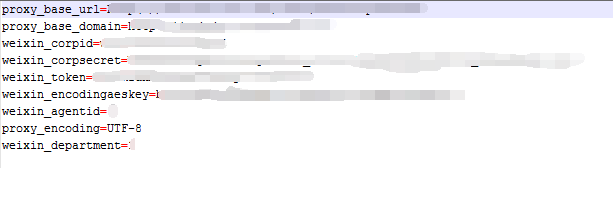
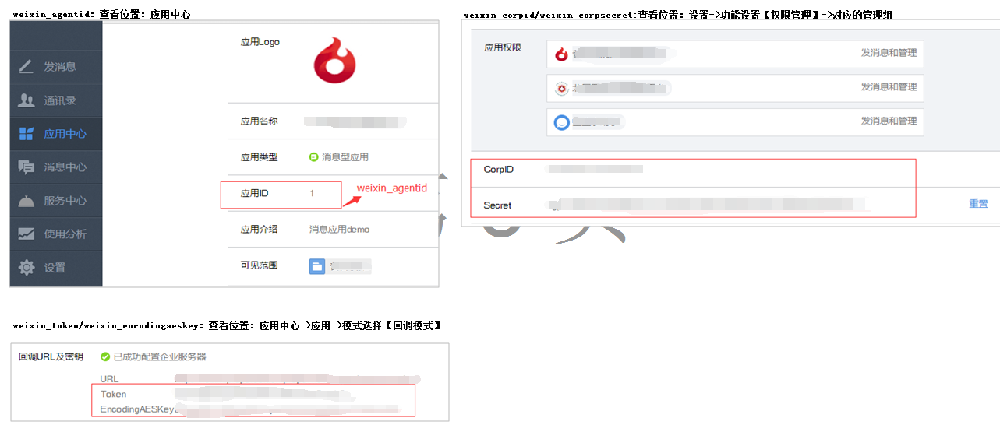

# 工大普日微信企业号现场实施操作手册
#### 作者：王贺
##### 版权所有©沈阳工大普日软件技术有限公司
目录
------

###[1. 微信工程需要修改的配置文件](#weixincon) 
###[2. home工程需要修改的配置文件](#homecon)
###[3. messagemanagement工程需要修改的配置文件](#msgcon)
###[4. 微信工程](#weixinpj)
    
微信工程需要修改的配置文件
===

说明
--
####- 配置文件位置：
####- properweixinqyoa\WEB-INF\classes\conf.properties

####1.proxy\_base_url为APP服务端地址
####2.proxy\_base_domain为域名
####3.weixin\_corpid、weixin\_corpsecret、weixin\_token、weixin\_encodingaeskey、weixin_agentid为微信工程重要的通信参数，获取这些参数需要管理员登录微信企业号管理平台，获取位置参照下图：

####4.weixin_department参数为部门ID，管理员可以在微信企业号管理平台的【通讯录】中【组织机构】中点击对应的机构即可看到对应的ID值。
####（注:因为目前没有将企业的内部组织结构放在微信企业号中进行维护，现在的处理方式是把所有的人员都放在一个组织机构中，以后如果要维护组织机构信息需要进行相应的开发）
  [回到首页](#home)

home工程需要修改的配置文件
===

说明
--
####- 需要执行SQL：
> comment on column hr\_personnel_person.column1 is '微信号';

  
####1.proper-hr-personnel中设置conf.properties 中的
> weixinHttpUrl=http://xxx.xxx.xxx.xxx/xxxx
####其中xxx.xxx.xxx.xxx更换为现场用户微信端服务器的微信内网ip地址

  
####2.uip-security项目中设置conf.properties 中的
> weixinHttpUrl=http://xxx.xxx.xxx.xxx/xxxx
####其中xxx.xxx.xxx.xxx更换为现场用户微信端服务器的微信内网ip地址

  [回到首页](#home)

messagemanagement工程需要修改的配置文件
===

说明
--
> \#add by wanghe 微信推送相关 start 
> \#微信推送模式(1:不推送,2:推送)\_部署工程时需要根据实际情况设定 
> weixin\_model = 2 
> \#微信推送域名地址\_部署工程时需要根据实际情况设定 
> weixin\_domain = http\://xxx.xxx.xx 
> \#微信推送工程地址\_部署工程时需要根据实际情况设定 
> weixin\_push_path = /xxxx 
> \# add by wanghe 微信推送相关 end

  [回到首页](#home)

微信工程
===

说明
--
####- 需要一个有公网IP和内网IP的机器
####- 需要有映射到该服务器公网IP的域名
####- 微信工程名为properweixinqyoa
####- JDK版本建议1.6
####- 需要一个单独运行的80端口的tomcat
####- 启动tomcat后，需要在企业号应用中进行回调模式的验证
####- 在企业微信号客户端，管理员输入"makeMenu"创建菜单，如果收到"创建菜单成功"则表示创建菜单成功
####PS：回调模式的验证：需要管理员用户登录到微信企业号管理平台，然后点击【应用中心】->选择想要验证的应用->【回调模式】->【回调URL及密钥】修改 -> 将配置文件中的回调URL及密钥填写到对应位置（注：回调URL为  http:// 域名 + /properweixinqyoa/weixincore/api） -> 验证成功
在验证时需要做特殊处理，需要注意的一点：调用过程中可能会出现java.security.InvalidKeyException:illegal Key Size的异常

解决方法：

在官方网站下载JCE无限制权限策略文件

请到官网下载对应的版本。

例如JDK7的下载地址：

[JDK7官方网站JCE无限制权限策略文件下载](http://www.oracle.com/technetwork/java/javase/downloads/jce-7-download-432124.html)

例如JDK6的下载地址：

[JDK6官方网站JCE无限制权限策略文件下载](http://www.oracle.com/technetwork/java/javase/downloads/jce-6-download-429243.html)

下载后解压，可以看到local_policy.jar和US_export_policy.jar以及readme.txt。

如果安装了JRE，将两个jar文件放到%JRE_HOME% \lib\security

目录下覆盖原来的文件，

如果安装了JDK，将两个jar文件放到%JDK_HOME%\jre\lib\security目录下覆盖原来文件。
  [回到首页](#home)